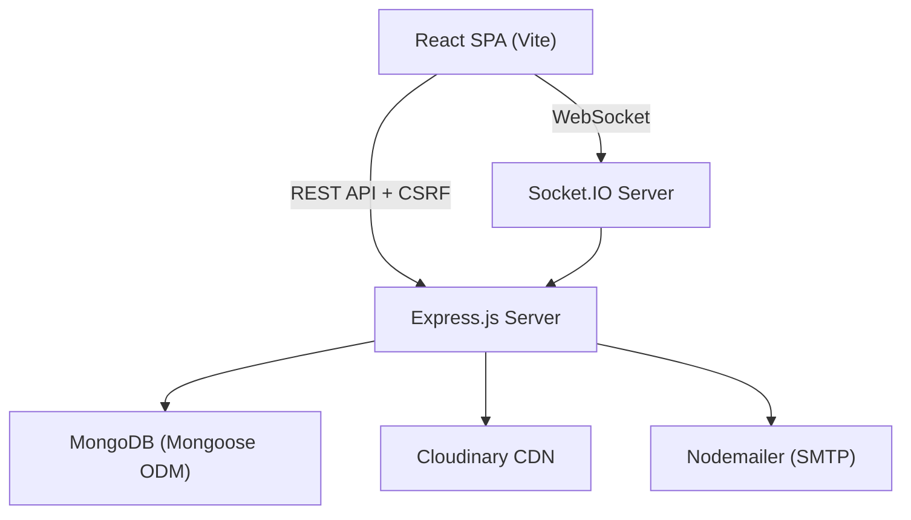
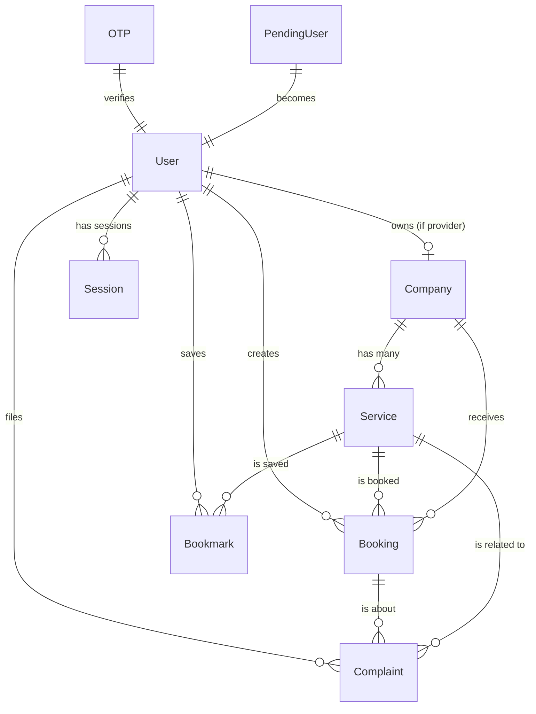

# 🎃 Phantom Agency (ServiceBee) — Complete Project Description

**Phantom Agency** is a full-stack, production-ready **service marketplace** web application that connects users with trusted local service providers. It features a distinctive dark "spooky/phantom" aesthetic, real-time bidirectional communication, role-based access control, a multi-stage complaint resolution workflow, and a comprehensive admin dashboard.

---

## 1. High-Level Architecture

The application follows a **three-tier Client–Server–Database** architecture augmented with a **real-time WebSocket layer**.



| Layer | Role |
|---|---|
| **Frontend (SPA)** | React 19 + Vite — handles UI rendering, client-side routing, state management via Context API, and real-time event listening |
| **Backend (REST + WebSocket)** | Express 5 + Socket.IO — handles business logic, authentication, authorization, and emits real-time events |
| **Database** | MongoDB with Mongoose 9 ODM — stores all persistent data across 9 collections |
| **External Services** | Cloudinary (image CDN), Gmail SMTP (transactional emails), Render (deployment) |

---

## 2. Technology Stack — Detailed Breakdown

### 2.1 Frontend

| Technology | Version | Purpose |
|---|---|---|
| **React** | 19.2 | Component-based UI framework |
| **Vite** | 7.2 | Lightning-fast dev server and build tool |
| **React Router DOM** | 7.13 | Client-side routing with nested layouts |
| **Tailwind CSS** | 3.4 | Utility-first CSS framework for styling |
| **Framer Motion** | 12.29 | Declarative page transition animations (`AnimatePresence`) |
| **GSAP** | 3.12.5 | High-performance scroll-triggered and timeline animations |
| **Lenis** | 1.3 | Smooth-scroll library for premium scroll UX |
| **Socket.IO Client** | 4.8 | Real-time WebSocket client |
| **Axios** | 1.13 | HTTP client with interceptors for CSRF token management |
| **React Hot Toast** | 2.6 | Toast notification system |

### 2.2 Backend

| Technology | Version | Purpose |
|---|---|---|
| **Express** | 5.2 | Web framework (latest major version) |
| **Mongoose** | 9.1 | MongoDB ODM with schemas, virtuals, hooks, statics |
| **Socket.IO** | 4.8 | Real-time bidirectional event-based communication |
| **JWT (jsonwebtoken)** | 9.0 | Stateless authentication tokens |
| **bcryptjs** | 3.0 | Password and OTP hashing (salt rounds: 10) |
| **Helmet** | 8.1 | HTTP security headers |
| **express-rate-limit** | 8.2 | Brute-force and DDoS protection |
| **csurf** | 1.11 | CSRF token generation and validation |
| **Multer** | 2.0 | Multipart form-data file upload parsing |
| **multer-storage-cloudinary** | 2.2 | Direct-to-Cloudinary upload storage engine |
| **Cloudinary** | 2.9 | Image hosting, transformation, and CDN |
| **Nodemailer** | 7.0 | SMTP-based transactional email delivery |
| **cookie-parser** | 1.4 | Cookie parsing middleware |
| **dotenv** | 17.2 | Environment variable management |
| **Nodemon** | 3.1 | Hot-reload dev server (dev dependency) |

---

## 3. Database Design (MongoDB — 9 Collections)



### 3.1 User Model
- **Fields**: name, email (unique, lowercase), password (bcrypt-hashed), phone, avatar, city, state, role (`user | provider | admin`), company (ObjectId ref), isActive, deactivatedAt, deactivationReason, bannedExpiresAt
- **Features**:
  - `pre('save')` hook — auto-hashes passwords with bcrypt; detects already-hashed passwords to prevent double-hashing
  - `matchPassword()` instance method — compares plaintext to hash
  - `canDelete()` static — checks for active complaints before allowing deletion
  - `softDelete()` static — deactivates user with reason and optional ban expiration
  - `forceDelete()` static — cascading cleanup of bookmarks, complaints, and ratings
  - `pre('deleteOne')` hook — enforces complaint check and cascading cleanup
  - **Indexes**: `email` (unique), `isActive`

### 3.2 Service Model
- **Fields**: name, description, price, priceType (`fixed | hourly | starting-from | quote`), state, city, category (16 enum values including themed ones like `ritual`, `exorcism`, `divination`), image (Cloudinary URL), imagePublicId, isActive, company (ref), ratings (embedded subdocument array), duration, createdBy (ref)
- **Features**:
  - **Embedded Rating subdocument** — user ref, value (1-5), review text, timestamps
  - `averageRating` virtual — computed average across all ratings
  - `totalReviews` virtual — count of ratings
  - `canDelete()`, `softDelete()`, `forceDelete()` statics with complaint-aware logic
  - **Text index** on name + description + city + state for full-text search
  - **Compound index** on category + city + state + price for filtered queries

### 3.3 Booking Model
- **Fields**: user, company, service (all ObjectId refs), date, status (`pending | accepted | rejected | completed | cancelled`), notes, address (snapshot)
- **Index**: compound on `{ user, service, status }`

### 3.4 Company Model
- **Fields**: name, description, serviceType, logo (Cloudinary), logoPublicId, email, phone, website, address (embedded: street/city/state/zip/country), owner (ref), isVerified, isActive, socialLinks (facebook/twitter/instagram/linkedin)
- **Virtuals**: `services` (populate all services), `serviceCount` (count virtual)
- **Cascade**: `pre('deleteOne')` deactivates all associated services

### 3.5 Complaint Model
- **Fields**: user, booking, service (all refs), subject, message, images (array of Cloudinary URLs + publicIds), status (6-value enum including `awaiting-confirmation` and `service-unavailable`), adminResponse, serviceProviderResponse, serviceProviderRespondedAt, resolvedBy, resolvedAt, serviceSnapshot (denormalized name/category/createdBy)
- **Pre-save hook**: prevents duplicate pending complaints per user-service pair; captures service snapshot on creation
- **Virtuals**: `serviceName`, `hasResponse`
- **Indexes**: compound on `{ user, createdAt }`, `{ status, createdAt }`, `{ serviceSnapshot.createdBy, status }`

### 3.6 Bookmark Model
- Unique compound index `{ user, service }` prevents duplicates
- Pre-save validates both service (active) and user (active) existence

### 3.7 OTP Model
- Stores hashed OTP (bcrypt) + hashed password for signup flow
- TTL index on `expiresAt` — MongoDB auto-deletes expired OTPs
- `verifyOTP()` instance method using bcrypt compare
- `createOTP()` static — cleans old entries, creates with 10-minute expiry

### 3.8 PendingUser Model
- Temporary storage during email verification (auto-expires after 24 hours via TTL)
- Stores company info for provider signups
- Hashes password on save

### 3.9 Session Model
- **Fields**: userId, token (unique), userAgent, ipAddress, isActive, lastActivity, expiresAt
- **TTL index** on `expiresAt` for auto-cleanup
- **Statics**: `createSession()`, `invalidateSession()`, `invalidateAllUserSessions()`, `invalidateDeviceSession()`, `getActiveSessions()`, `updateActivity()`

---

## 4. Authentication & Authorization System

### 4.1 Signup Flow (Multi-Step with Email Verification)
```
User submits form → POST /auth/signup → PendingUser created → OTP emailed
→ User enters OTP → POST /auth/verify-otp → User + Company (if provider) created
→ Session created → JWT cookie set → Redirect to dashboard
```

1. User submits name, email, password, role, and optionally company details
2. Server validates, creates a `PendingUser` document with a hashed OTP
3. OTP is sent via styled HTML email (Nodemailer + Gmail SMTP)
4. User submits OTP → server verifies against `PendingUser`
5. On match: creates `User` (+ `Company` for providers), deletes `PendingUser`, creates a `Session`, sets JWT in an HttpOnly cookie
6. **Resend OTP**: `POST /auth/resend-otp` generates a fresh OTP

### 4.2 Login Flow
1. Email/password validated against `User` collection
2. Checks `isActive` flag — if banned, checks `bannedExpiresAt` for auto-unban
3. On success: invalidates previous sessions from the same device (User-Agent), creates new `Session`, sets JWT cookie

### 4.3 Password Reset Flow (3-Step)
```
POST /auth/forgot-password (email) → OTP emailed
→ POST /auth/verify-reset-otp (email + OTP) → short-lived resetToken returned
→ POST /auth/reset-password (resetToken + newPassword) → password updated
```

### 4.4 JWT & Session Management
- **JWT**: signed with `JWT_SECRET`, 30-day expiry, stored in HttpOnly secure cookie (`jwt`)
- **Session**: every JWT is backed by a `Session` document — enables server-side invalidation
- **Auth Middleware** (`protect`): extracts JWT from cookie or Bearer header → verifies → checks active session → attaches `req.user`
- **Logout**: invalidates session, clears cookies
- **Logout All**: invalidates all sessions for the user across all devices

### 4.5 Role-Based Authorization
Three roles: `user`, `provider`, `admin`
- `authorize(...roles)` middleware — restricts routes to specified roles
- Frontend `<ProtectedRoute allowedRoles={[...]}>`  — redirects unauthorized users
- Nested route layouts: `/admin/*` (AdminLayout), `/provider/*` (ProviderLayout), `/user/*` (Layout)

---

## 5. Security Features

| Feature | Implementation |
|---|---|
| **CSRF Protection** | `csurf` middleware with double-submit cookie pattern; frontend auto-fetches and attaches `x-csrf-token` header on mutation requests via Axios interceptor; auto-retries on 403 CSRF errors |
| **Rate Limiting** | Auth routes: 100 req/15min; API routes: 500 req/15min |
| **Helmet** | Sets security HTTP headers (X-Frame-Options, CSP, HSTS, etc.) |
| **MongoDB Injection Prevention** | Custom `mongoSanitize` middleware strips `$`-prefixed and dot-containing keys from `req.body`, `req.params`, `req.query` (Express 5 compatible) |
| **Password Hashing** | bcrypt with 10 salt rounds; double-hash prevention |
| **OTP Hashing** | OTPs are bcrypt-hashed before storage |
| **Input Validation** | Mongoose schema validators (regex, min/max length, enums) + controller-level validation |
| **XSS Prevention** | `escapeHtml()` utility sanitizes all user-generated content in emails |
| **Cookie Security** | HttpOnly, Secure (production), SameSite: strict |
| **CORS** | Whitelist-based origin validation; credentials enabled |
| **Regex Escaping** | `escapeRegex()` utility prevents ReDoS attacks in search queries |
| **Request Body Limits** | JSON body limited to 10KB via Express |
| **Socket Authentication** | Socket.IO connections authenticated via JWT from handshake auth or cookies |
| **Privacy Redaction** | Provider cannot see customer phone/email/address until booking is accepted |

---

## 6. Real-Time Communication (Socket.IO)

### 6.1 Architecture
- **Server**: Socket.IO instance attached to the HTTP server with CORS matching the REST API
- **Authentication**: `socketAuth` middleware verifies JWT and attaches `socket.user`
- **Room Strategy**: each user joins a room named after their `userId` — enables targeted messaging
- **Emitter Pattern**: `emitter.js` stores the `io` instance globally so controllers can emit events without circular imports

### 6.2 Event Catalog

| Event (Client → Server) | Event (Server → Client) | Purpose |
|---|---|---|
| `booking:create` | `booking:new` | Notify provider of new booking |
| `booking:update` | `booking:updated` | Notify customer of status change |
| — | `booking:cancelled` | Notify provider of cancellation |
| `complaint:create` | `complaint:new` | Notify provider of new complaint |
| `complaint:update` | `complaint:updated` | Notify user of complaint status change |
| — | `service:created` | Broadcast new service to all |
| — | `service:updated` | Broadcast service update |
| — | `service:deleted` | Broadcast service removal |
| — | `user:online` / `user:offline` | Online presence tracking |

### 6.3 Frontend Integration
- `SocketContext` manages connection lifecycle — auto-connects when `user._id` is available, auto-disconnects on logout
- Tracks `onlineUsers` Set and exposes `isUserOnline(userId)` helper
- WebSocket transport with polling fallback; 5 reconnection attempts with 1s delay

---

## 7. Service Marketplace Features

### 7.1 Service Discovery
- **Full-text search** across name, description, city, state (MongoDB text index)
- **Filters**: category, state, city, price range (min/max), minimum rating
- **Sorting**: price ascending/descending, rating, newest
- **Pagination**: configurable page size (default 12)
- **Featured Services**: top 6 by average rating

### 7.2 Service Ratings & Reviews
- **Verified-purchase-only**: users can only rate services they've booked and completed
- **Update or create**: existing ratings are updated in-place; new ratings are appended
- 1-5 star scale with optional text review (max 500 chars)
- `averageRating` and `totalReviews` computed as Mongoose virtuals

### 7.3 Bookmarking / Favorites
- Toggle bookmark on any active service
- `GET /api/bookmarks/check/:serviceId` for instant bookmark status check
- Unique compound index prevents duplicate bookmarks
- Pre-save validation ensures referenced service and user are both active

### 7.4 Service CRUD (Provider)
- Providers must have a company before creating services (enforced server-side)
- Company ID is auto-derived from the provider's company (cannot be spoofed)
- Image upload via Cloudinary with auto-quality and format optimization
- Old images are deleted from Cloudinary before replacement

### 7.5 Service Deletion Workflow (Soft/Force/Safe)
```
DELETE /api/services/:id
├── ?soft=true → Deactivate (set isActive=false)
├── ?force=true → Force delete + handle active complaints + cleanup bookmarks
└── (default) → Safe delete only if no active complaints exist
```
- Admin deleting another user's service triggers an **email notification** to the service owner

---

## 8. Booking System

### 8.1 Booking Lifecycle
```
User creates booking → status: pending
├── Provider accepts → status: accepted (user phone/email/address revealed)
├── Provider rejects → status: rejected
├── Provider completes → status: completed
└── User cancels (only while pending) → status: cancelled
```

### 8.2 Privacy-Preserving Design
- When booking status is `pending`, provider sees redacted contact info: `🔒 Hidden (Accept to view)`
- Contact details (phone, email, address) are only revealed after acceptance

### 8.3 Real-Time Updates
- `booking:new` emitted to provider on creation
- `booking:updated` emitted to customer on status change
- `booking:cancelled` emitted to provider on cancellation

---

## 9. Complaint Resolution System (Multi-Party Workflow)

### 9.1 Complaint Lifecycle (6 Statuses)
```
User files complaint → status: pending
├── Provider responds → status: in-progress
│   └── Provider marks resolved → status: awaiting-confirmation
│       ├── User confirms resolution → status: resolved
│       └── (User does nothing / disputes — stays awaiting-confirmation)
├── Admin resolves → status: resolved
├── Admin rejects → status: rejected
└── Service deleted while complaint active → status: service-unavailable
```

### 9.2 Features
- **Image attachments**: up to 3 images per complaint (Cloudinary, 5MB each)
- **Service snapshot**: complaint captures service name/category/createdBy at creation time — complaint remains meaningful even if service is later deleted
- **Duplicate prevention**: one pending complaint per user per service
- **Three-party involvement**: user files, provider responds, admin oversees
- **Complaint statistics** (admin): aggregation pipeline computing total, by-status breakdown, resolution rate, average resolution time in hours
- **Email notifications**: complaint status changes trigger styled HTML emails
- **Real-time updates**: all parties notified via Socket.IO

---

## 10. Admin Dashboard

### 10.1 Overview Page — Statistics
- Total users (customers + providers), services, companies, complaints (total + pending), bookings, revenue (sum of completed booking service prices)
- **Recent activity feed**: merged timeline of recent bookings, complaints, signups, and company registrations — sorted chronologically, limited to 10

### 10.2 User Management
- View all users (optionally including inactive/banned)
- Update user roles (`user` ↔ `admin`)
- **Delete with safeguards**:
  - Safe delete: only if no active complaints
  - Soft delete (ban): deactivate with reason + optional duration in days
  - Auto-unban: expired bans are automatically lifted on next login attempt
  - Cascade: deleting a provider also removes their company, services, and Cloudinary assets
- **Reactivate** banned users
- **Email notifications**: ban, deletion, and reactivation trigger styled emails to the user

### 10.3 Service Management
- View all services with company info
- Delete services (soft/force) with email notification to the service owner
- Admins **cannot edit** services (enforced server-side) — only the creator can edit

### 10.4 Complaint Management
- View all complaints with pagination and status filtering
- Update complaint status with admin response
- Delete complaints (with force flag for in-progress ones)
- Cloudinary image cleanup on complaint deletion

### 10.5 Company Management
- View all companies with service count and owner info
- Verify companies (`isVerified` flag)
- Delete companies with cascade (deactivates all services, removes logo from Cloudinary)

---

## 11. Company & Provider Features

### 11.1 Company Profile
- Full CRUD with logo upload to Cloudinary
- Public profile page with: company details, social links, all active services, stats (completed bookings, overall rating, total reviews)
- One company per provider (enforced)

### 11.2 Provider Dashboard
- **Profile management**: edit company details, upload logo
- **Service management**: create/edit/delete services, upload images
- **Booking management**: view incoming bookings, accept/reject/complete
- **Complaint management**: view complaints against own services, respond, propose resolution

---

## 12. Email System (Nodemailer)

### 12.1 Transporter Configuration
- Auto-detects Gmail for the `service: 'gmail'` preset (bypasses port-blocking on cloud platforms)
- Falls back to custom SMTP host/port configuration
- Connection/greeting/socket timeouts: 10 seconds each

### 12.2 Email Types

| Email | Trigger | Content |
|---|---|---|
| **OTP Verification** | Signup | 6-digit code, 10-minute expiry |
| **Password Reset** | Forgot password | OTP code for verification |
| **Complaint Status Update** | Admin/provider updates complaint | Subject, service name, new status badge, admin/provider response |
| **Service Action** | Admin deletes/suspends a service | Service name, action badge (DELETED/SUSPENDED), reason |
| **Account Action** | Admin bans/deletes/reactivates a user | Account status badge (BANNED/DELETED/REACTIVATED), reason |

### 12.3 Email Template
All emails share a **dark-themed HTML template** with:
- `#09090b` background (zinc-950)
- Gradient header with "PHANTOM AGENCY" branding
- Content area with color-coded status badges
- Footer with copyright and "do not reply" notice
- XSS protection via `escapeHtml()` on all user-generated content

---

## 13. File Upload System (Cloudinary + Multer)

### 13.1 Storage Configuration
Four dedicated Cloudinary folders:
- `servicebee/logos` — company logos (2MB limit)
- `servicebee/services` — service images (5MB limit)
- `servicebee/complaints` — complaint evidence images (5MB × 3 max)
- `servicebee/avatars` — user profile pictures (2MB limit)

### 13.2 Image Processing
- Allowed formats: JPG, JPEG, PNG, WebP
- Auto-quality and auto-format transformation on upload
- Old images are deleted from Cloudinary before replacement (prevents orphaned assets)
- `getPublicIdFromUrl()` utility extracts Cloudinary public ID from URL

---

## 14. Frontend Architecture & UI/UX

### 14.1 State Management
- **AuthContext**: manages user state, login/signup/logout/logoutAll functions, loading state; checks `logged_in` cookie on mount to restore sessions
- **SocketContext**: manages Socket.IO connection lifecycle, online users tracking, auto-connect/disconnect tied to auth state

### 14.2 Routing Structure
```
/ or /login or /signup  → AuthPage
/admin/*                → AdminLayout (admin only)
  /admin/overview       → Dashboard statistics
  /admin/services       → Service management
  /admin/complaints     → Complaint management
  /admin/users          → User management
/provider/*             → ProviderLayout (provider only)
  /provider/profile     → Company profile & management
  /provider/services    → Service CRUD
  /provider/bookings    → Booking management
  /provider/complaints  → Complaint responses
/user/*                 → Layout with Navbar/Footer (user only)
  /user/services        → Service browsing
  /user/services/:id    → Service detail + booking + rating
  /user/profile         → User profile
  /user/bookings        → Booking history
  /user/complaints      → Complaint management
  /user/favorites       → Bookmarked services
  /user/company/:id     → Company public profile
/terms                  → Terms & conditions
```

### 14.3 UI Components

| Component | Purpose |
|---|---|
| `ParticleBackground` | Canvas-based interactive particle system (orange + purple particles with wave motion, mouse repulsion with swirl effect, inter-particle connection lines, glow on hover) |
| `SmoothScroll` | Lenis-powered smooth scrolling wrapper |
| `PageTransition` | Framer Motion `AnimatePresence` page transitions |
| `ErrorBoundary` | React error boundary with fallback UI |
| `CustomSelect` | Styled dropdown select component |
| `ImageModal` | Full-screen image viewer overlay |
| `ImageUpload` | Drag-and-drop image upload with preview |
| `ServiceFilters` | Filter sidebar for service browsing |
| `ComplaintModal` | Modal form for filing complaints with image upload |
| `ProtectedRoute` | Role-based route guard component |

### 14.4 Animations & Visual Effects
- **Framer Motion**: page entry/exit animations via `AnimatePresence` with `mode="wait"`
- **GSAP**: scroll-triggered animations, timeline sequences
- **Lenis**: smooth momentum-based scrolling
- **Particle System**: 300 canvas particles with multi-layer wave motion, turbulence, mouse-interactive repulsion + swirl, inter-particle gradient connections, HiDPI/retina support
- **React Hot Toast**: styled dark-theme toast notifications

### 14.5 Axios Configuration
- Base URL set from `VITE_API_URL` environment variable
- `withCredentials: true` for cookie-based auth
- Request interceptor: auto-fetches and attaches CSRF token for POST/PUT/DELETE/PATCH
- Response interceptor: auto-retries on CSRF 403 errors (re-fetches token and replays request)

---

## 15. Deployment & DevOps

### 15.1 Render Blueprint (`render.yaml`)
Infrastructure-as-Code deployment:
- **Backend**: Node.js Web Service (free tier, Oregon region)
- **Frontend**: Static Site with SPA rewrite rule (`/* → /index.html`)
- Environment variables configured as secrets in Render dashboard

### 15.2 Vercel Support
- `vercel.json` present for alternative frontend deployment
- `vercel-build` script in frontend `package.json`

### 15.3 Development Workflow
- **Root-level scripts**: `npm run install-all` installs both frontend and backend dependencies
- **Backend dev**: `nodemon` with hot-reload on port 5000
- **Frontend dev**: Vite dev server on port 5173
- **Seed script**: populates database with dummy data and a Super Admin account (`admin@servicebee.com`)
- **ESLint**: configured for both frontend (React plugin) and backend

### 15.4 Production Optimizations
- Backend serves frontend's built static files in production mode
- Catch-all route serves `index.html` for SPA client-side routing
- Request logging only in non-production environments
- Error stack traces only in non-production responses

---

## 16. Key Design Patterns & Concepts

| Pattern | Where Used |
|---|---|
| **MVC** | Backend: Models → Controllers → Routes |
| **Context API** | Frontend global state (Auth, Socket) |
| **Middleware Chain** | Express: helmet → rate-limit → CORS → body-parser → cookie-parser → CSRF → mongoSanitize → auth → authorize |
| **Async Handler** | `asyncHandler` wrapper eliminates try-catch boilerplate in controllers |
| **Custom AppError** | Operational vs. programming error distinction with `isOperational` flag |
| **Soft Delete** | Users and services can be deactivated without data loss |
| **Cascading Delete** | Deleting a user cascades to bookmarks, complaints, ratings; deleting a company cascades to services |
| **Service Snapshot** | Complaints store denormalized service data so they remain meaningful after service deletion |
| **Emitter Singleton** | Socket.IO instance stored globally via `setIO()`/`getIO()` to avoid circular imports |
| **TTL Indexes** | OTP and PendingUser documents auto-expire; Sessions auto-cleanup |
| **Compound Indexes** | Optimized queries for bookmarks, bookings, services, complaints |
| **Virtual Fields** | Computed properties (averageRating, totalReviews, serviceCount) without data duplication |
| **Pre-save Hooks** | Password hashing, OTP hashing, duplicate prevention, data validation, snapshot capture |
| **Protected Routes** | Frontend role-based route guards + backend `authorize()` middleware |
| **Interceptor Pattern** | Axios request/response interceptors for CSRF token lifecycle |
| **Privacy by Design** | Contact info redacted until booking acceptance |

---

## 17. Summary of All Features at a Glance

1. **Email-verified signup** with OTP (hashed, auto-expiring)
2. **Dual-role signup** — users and service providers (with company creation)
3. **JWT + Session-backed authentication** with HttpOnly cookies
4. **Multi-device session management** (logout single / logout all)
5. **3-step password reset** (email → OTP → reset token → new password)
6. **Auto-unban** when ban duration expires
7. **Service marketplace** with full-text search, multi-filter, sorting, pagination
8. **Service ratings & reviews** (verified-purchase-only)
9. **Bookmarking / favorites** system
10. **Booking system** with status lifecycle and privacy-preserving design
11. **Multi-party complaint resolution** (user → provider → admin) with 6 statuses
12. **Image uploads** to Cloudinary (services, logos, avatars, complaint evidence)
13. **Real-time notifications** via Socket.IO (bookings, complaints, services, presence)
14. **Admin dashboard** with statistics, user/service/complaint/company management
15. **Transactional emails** (OTP, password reset, complaint updates, account actions, service actions)
16. **CSRF protection** with auto-fetch and retry
17. **Rate limiting**, **Helmet headers**, **MongoDB injection prevention**, **XSS sanitization**
18. **Interactive particle background** with mouse-reactive animations
19. **Smooth scrolling** (Lenis), **page transitions** (Framer Motion), **scroll animations** (GSAP)
20. **Infrastructure-as-Code deployment** (Render Blueprint)
